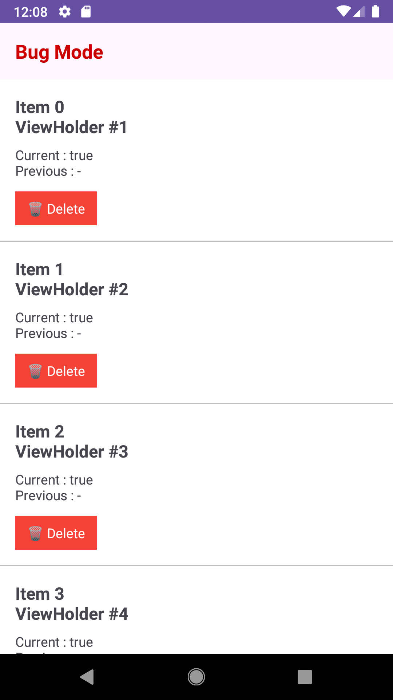
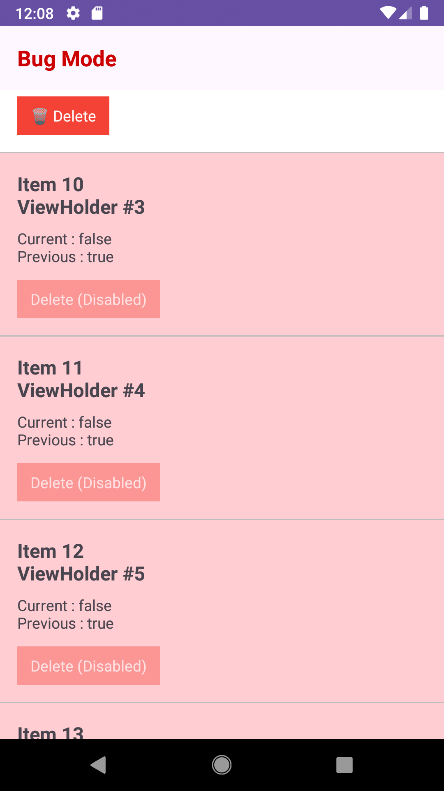
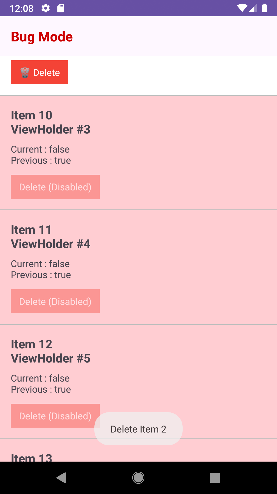
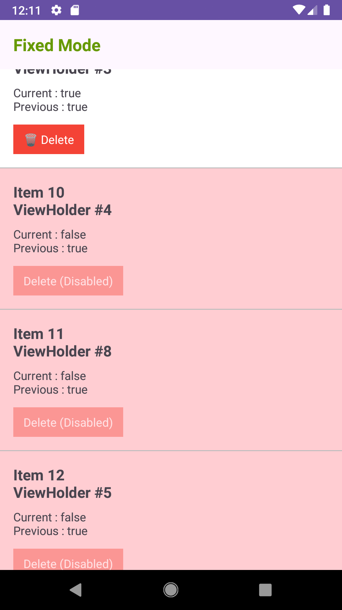

# RecyclerView Reuse Sample

RecyclerViewのViewHolder再利用によって発生する、`ClickListener`のリセット漏れを再現するサンプルアプリです。

以下の記事で解説している内容を、実際に動かして確認できます。

> （Qiita公開後に記事URLを追加）

## サンプルで確認できること

- RecyclerViewのViewHolderが再利用される様子
- `ClickListener`をリセットしなかった場合に発生する不具合
- `setOnClickListener(null)`でリセットした場合の挙動

## スクリーンショット

| 初期状態                    | ViewHolder再利用          |
|-------------------------|------------------------|
|  |  |

初期状態ではItem 0〜9のみ削除可能です。スクロールすると、赤色のセルでViewHolderが再利用されたことを確認できます。

| BUG Mode                 | FIXED Mode                 |
|--------------------------|----------------------------|
|  |  |

BUG Modeでは以前のClickListenerが実行されます。FIXED ModeではClickListenerをリセットしているため、不具合は発生しません。

## 動作モード

`MainActivity.kt`の`sampleMode`を書き換えることで切り替えられます。

```kotlin
private val sampleMode = SampleMode.BUG
```

または

```kotlin
private val sampleMode = SampleMode.FIXED
```

変更後にアプリを再ビルドしてください。

| Mode  | 内容                          |
|-------|-----------------------------|
| BUG   | ClickListenerをリセットせず、不具合を再現 |
| FIXED | ClickListenerをリセットし、修正版を確認  |

## 動作環境

- Android Studio
- Kotlin
- RecyclerView
- ViewBinding

## ライセンス

MIT License
