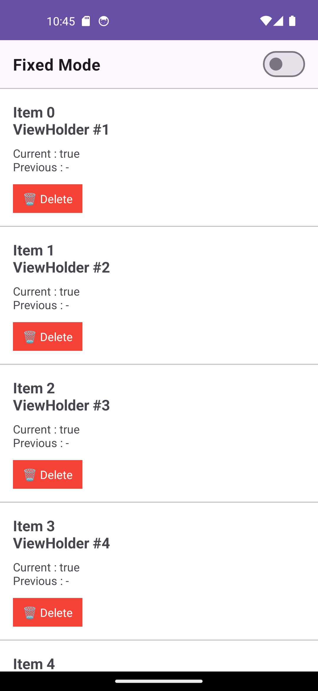
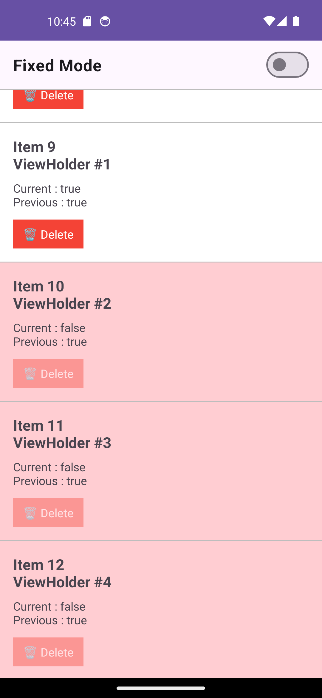
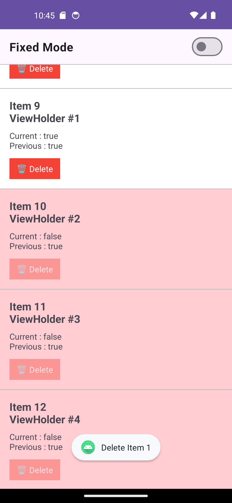
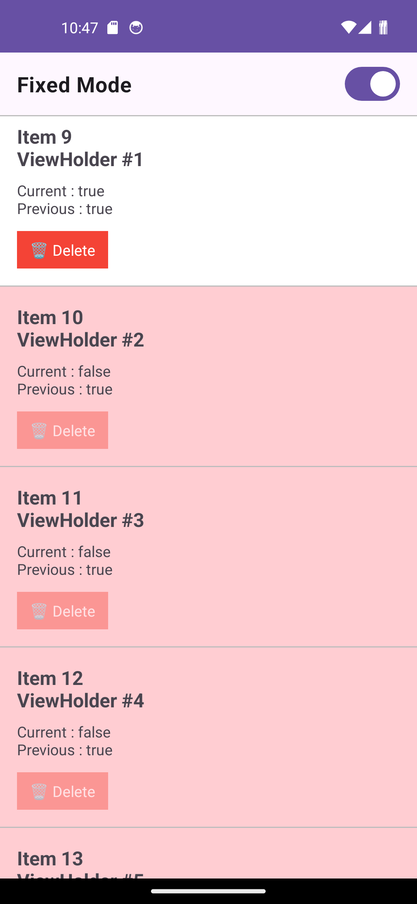

# RecyclerView Reuse Sample

Qiita記事のサンプルコードとして作成したアプリです。

RecyclerViewのViewHolder再利用によって発生する、`ClickListener`のリセット漏れを実際に動かして確認できます。

## サンプルで確認できること

- RecyclerViewでViewHolderが再利用される様子
- `ClickListener`をリセットしなかった場合に発生する不具合
- `setOnClickListener(null)`でリセットした場合の挙動

## スクリーンショット

### 初期状態

初期状態では、Item 0〜9のみ削除可能です。

### ViewHolder再利用

スクロールすると、ViewHolderが別のアイテムへ再利用されます。

赤色のセルは、

- 前回表示していたアイテム：削除可能（`canDelete = true`）
- 現在表示しているアイテム：削除不可（`canDelete = false`）

へ切り替わったことを表しています。

※緑色（`false → true`）は再利用を可視化するための補助表示です。記事では`true → false`のケースを扱っています。

### BUG Mode

以前表示していたItemの`ClickListener`が残っているため、
現在のItemとは異なる処理が実行されます。

### FIXED Mode

`ClickListener`をリセットしているため、不具合は発生しません。

## 動作モード

画面上部のスイッチで、BUG Mode と FIXED Mode を切り替えられます。

| Mode | 内容 |
|------|------|
| BUG | `ClickListener`をリセットせず、不具合を再現 |
| FIXED | `ClickListener`をリセットし、修正版を確認 |

## 動作環境

- Android Studio
- Kotlin
- RecyclerView
- ViewBinding

## ライセンス

MIT License

## 関連記事

Qiitaで解説記事を公開しています。

- [RecyclerViewはViewを使い回す。onBindViewHolder()で状態をリセットしないと起こる問題](https://qiita.com/nao-android/items/4a42d18d2b764f362ef2)
